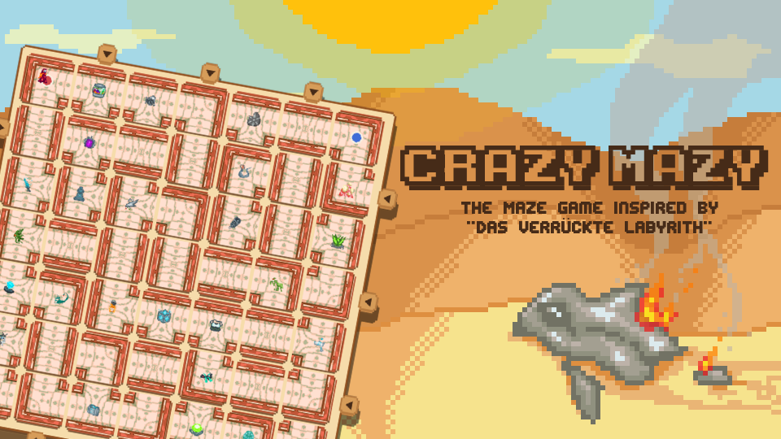

<p align="center">
  
  <h3>Crazy Mazy</h3>
</p>

Crazy Mazy is a multiplayer Python implemenation of the board game "Das verrückte Labyrinth".
It was built as a 2-week project during a Software Engineering Praktikum at University.

## Installation

0. Prerequisites: Python 3.11+ and pip.

1. Create and activate a virtual environment.

  ```bash
  python -m venv .venv
  source .venv/bin/activate
  ```

  Windows:

  ```powershell
  .venv\Scripts\activate
  ```

2. Install the dependencies.

  ```bash
  pip install -r requirements.txt
  ```

3. Create your local environment file.

  ```bash
  cp .env.example .env
  ```

  The example file is set to use localhost and mostly doesn't require changes.

  For testing NPC vs NPC without a player needing to be an active participant, set `ALLOW_NPC_PLAY` to `true` in the `.env` file.

## Running The Project

Start server and one client:

```bash
make dev
```

Start server and two clients:

```bash
make dev2
```

To start the server on Windows, run:

```powershell
./dev.sh -c <number_of_clients>
```

This is sadly required because window's honcho is broken.

If you dont wanna start all at once, you can start the server and clients separately with:

```bash
python -m server.main
python -m client.main
```

This is useful when connecting to a remote server.

## Testing

Run the test suite with:

```bash
pytest
```

## Project Structure

- `client/`:   Pygame client, screens, UI, sound, and networking
- `server/`:   authoritative game server and persistence layer
- `shared/`:   models, protocol, events, and shared game logic
- `assets/`:   images, fonts, music, sounds, and branding material
- `docs/`:     architecture and implementation documentation
- `tests/`:    automated test suite

## Documentation

Start with [docs/README.md](./docs/README.md) for the implementation overview, as well as the game flow logic.
